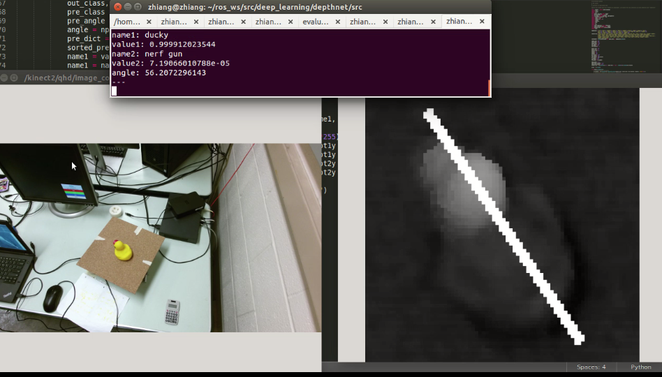

# DepthNet
---
Zhiang Chen, Nov 2016

### DepthNet


### Results
* [Video](https://www.youtube.com/watch?v=qwG2HYK_bys)
* Images: the white bar is the predicted orientation that is the tangent direction of grasping.



### Usage
```shell
roslaunch kinect2_bridge kinect2_bridge.launch
rosparam load ...
rosrun depthnet box_points_pub
rosrun orthaffine_projection orthaffine.py
rosrun orthaffine_projection cropper.py
rosrun depthnet evaluator.py
rostopic echo prediction
rosrun image_view image_view image:=/cropped_box_image/image
```
